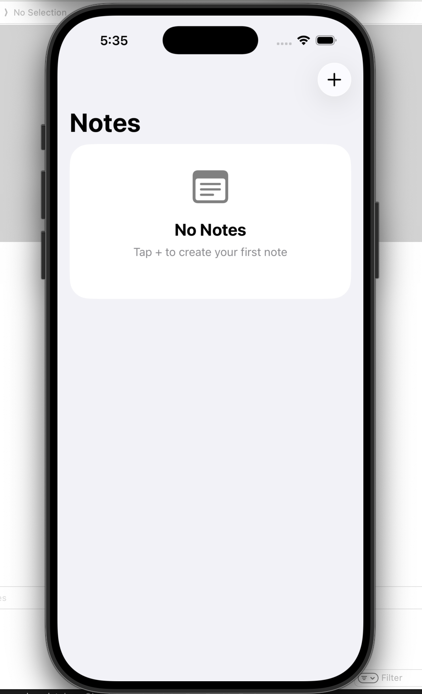
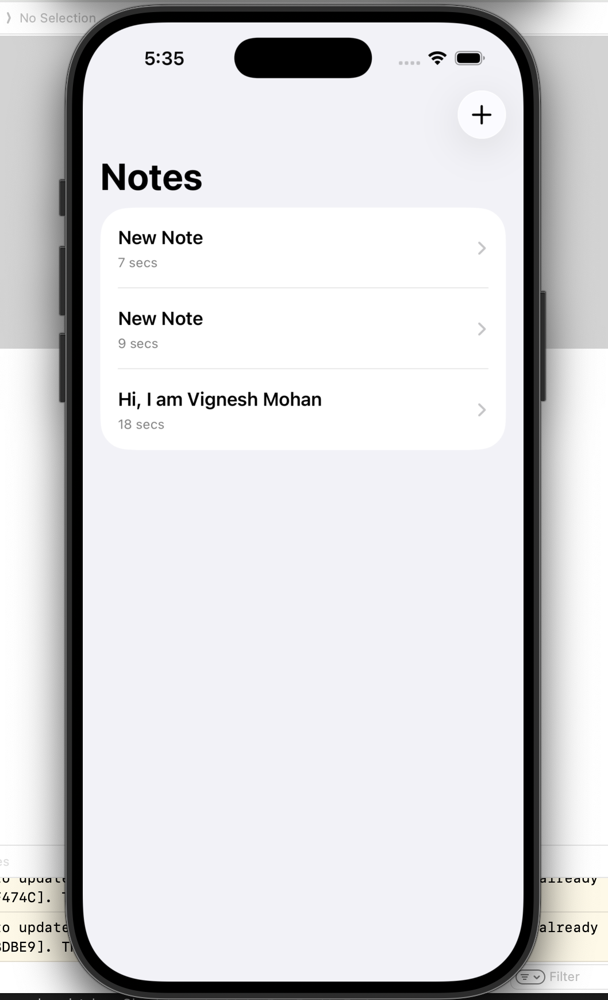
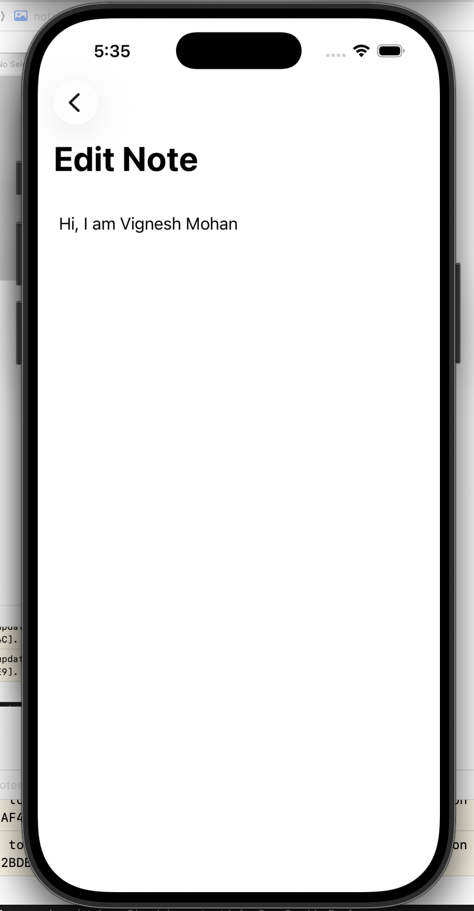
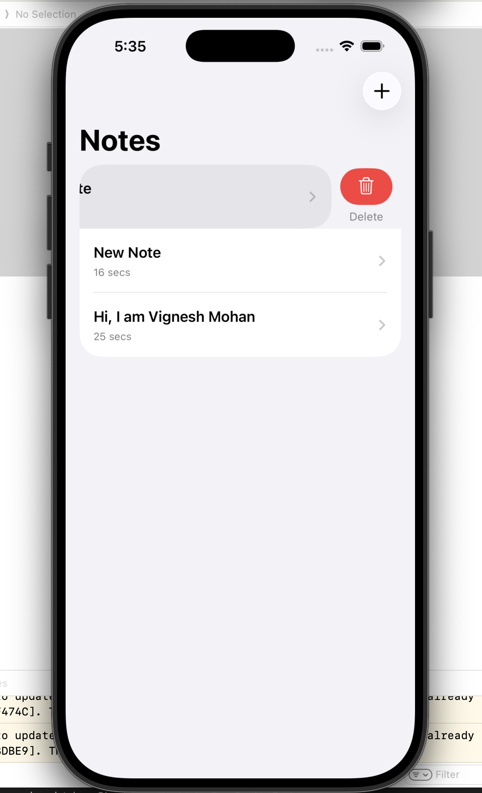

# CrazzyyNotes 📝

A lightweight iOS Notes app built with **SwiftUI** and **SwiftData**, focused on clean architecture, modern iOS APIs, and production-ready patterns.

## Features
- Create, edit, and delete notes
- Auto-saves content using SwiftData
- Notes sorted by last updated time
- Empty-state UX using `ContentUnavailableView`
- NavigationStack-based flow
- System-consistent UI (iOS-native look & feel)

## Tech Stack
- SwiftUI
- SwiftData
- NavigationStack
- MV-style separation
- iOS 17+

## Why this project
This project was built to demonstrate:
- Real-world SwiftUI app structure
- Local persistence with SwiftData
- Clean navigation and state handling
- Git hygiene and professional workflow

## Screenshots

### Notes Home

### Notes List

### Note Editor

### Notes Delete

